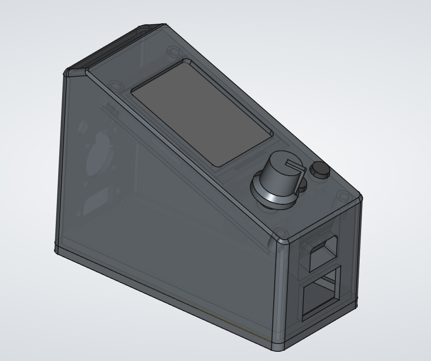

# Enclosure for Aixun T420 stand

This enclosure is generic enough but was primarily designed for Aixun T420 which I bought at some point.

Design was done in FreeCAD. STEP file was generated off original PCB in KiCAD.

## BOM

Links are to sellers where each component was bought. Cheaper options may be available from alternative sources.

| Item | AliExpress Link | Comments |
|------|-----------------|----------|
| XT60M | https://www.aliexpress.com/item/1005006996906406.html | Used as power plug |
| C245 replacement socket | https://www.aliexpress.com/item/1005002522875446.html | Found like-hirose connection. Original part was hard to source |
| 2mm banana socket | https://www.aliexpress.com/item/1005008119262551.html | Design was done for M6 thread |
| Aixun T420 Stand | https://www.aliexpress.com/item/1005005982469885.html | Potentially any stand with similar connector will work |
| Aixun Handle | https://www.aliexpress.com/item/1005005081918036.html | Choose option for T420 |
| KCD2 202 6P switch | https://www.aliexpress.com/item/1005008336906735.html | Mounting hole is is 19.2mm x 13mm |
| 8mm anti-slip pads | sourced locally | Mounting pockets are 8mm diamter, 0.6 mm deep |
| M2x3.5x3.0 Heat Insert | https://www.aliexpress.com/item/1005008309060936.html | 4 needed, holes are 3.2mm diameter |
| M2 BHCS | Sourced as part of set | 2x4mm and 2x8 for PCB, 4x8mm and 4 nuts for C245 socket |
| M2.5x8 SHCS | Sourced as part of set | 2 needed to mount XT60M to enclosure |
| 2.8mm Crimp Terminals | https://www.aliexpress.com/item/4000964054489.html | 5 needed |

## Printing Notes

Print in ABS scaling by 1% (i.e. 101% size) to accommodate shrinking . Other materials may work. Can be printed without supports LCD face on the build plate.

## Build Notes

18 AWG has been used for wiring (except stand sense where 22 AWG was used).

Stand doesn't have grounding and banana socket is used to wire stand sense. On Stand side M4x5 has been used to mount wire which plugs into stand sense.

Wiring might be a bit cramped. Solder 2 wires (around 100mm each) to XT60M and crimp them on the other side. These will be used to connect power input from XT60M to rocker switch.

Crimp another pair (approx 100mm each) on one side - they will be used to connect rocker switch to VIN/GND terminals on PCB. Insert rocker switch. Connect rocker switch to pcb.

Cut 50 mm of 22AWG to connect banana socket. Crimp it on one side.
Insert banana socket and affix it to enclosure. Connect crimped wire from step above to PCB.

Cut 50 mm of coloured cable and solder them to C245 connector. Do this outside of enclosure.
Insert C245 Socket. Connect pre-soldered wires to PCB. Carefully insert M2 screws (tweezers recommended) and screw with M2 nuts. Do one at a time. This step is tricky and requires patience.

Insert XT60M (with presoldered and crimped wires) and affix it using M2.5 screws. Connect crimped wires to switch terminals.

Dobule check polarity and check that rocker switch connection is correct.

Attach a length of 22AWG wire and 2mm banana plug to your stand.

Glue in anti-slip pads to the case bottom.

Glue in bottom to the top part.
