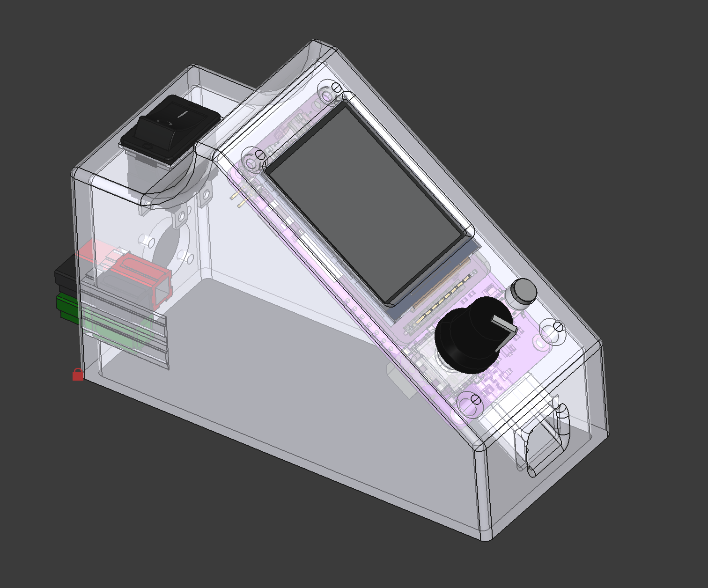
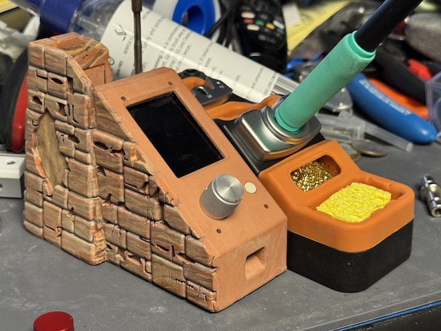
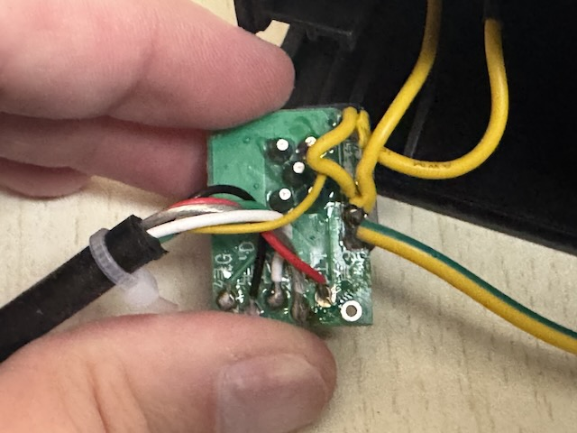

# Geeboon SDC02 Enclosure

This is an enclosure for AxxSolder which fits the Geeboon SDC02 handpiece stand.

It was [designed in FreeCAD](https://www.freecad.org)

I first fabricated it using an Elegoo Mars 4 DLP resin 3D printer. The Mars 4
DLP has a 50 μm minimum feature size. I don't know how well it'll work if
printed with an FDM 3D printer; fortunately the CAD files and FreeCAD are open
source, and you can modify it to your needs.

I decided a "plain" stand was boring, so I also searched for 3D printable
tabletop diorama terrain, and used my slicer to merge this enclosure with a
wall texture, which I then painted as the Red Rock sandstone in the Colorado
Plateau.

I also created a slightly different enclosure for the LRS-150-24, which is able
to accomodate a 14 AWG grounded plug pigtail (as is easily found in a Big Box
Store in North America).

## Hardware Notes:

- This stand uses the same Hirose Connector as the AxxSolder Portable, as the
  Geeboon SDC02 has a plug which connects to the Hirose connector.
- As with the JBC ADS stand, this uses Anderson Power Poles to connect an external power supply
- It's capable of accepting a USB-PD plug in the front of the enclosure.

## Alternative Handpieces:

* The Sugon T-115 handpiece (**without** buttons) needs to be rewired to match the contacts listed in the AxxSolder README. It takes a few minutes.
* The Sugon T-210 and T-245 handpieces (again **without** buttons) are find out of the box.

## Geeboon Stand Rewiring:

The Geeboon Stand doesn't _quite_ follow the standard JBC pinout. 

To open the Geeboon SDC02 stand:
1. Remove the rubber feet. Each rubber foot covers a screw.
2. In the center of the bottom label, there's an indentation. Cut or punch a hole in the label, and the final screw is underneath.

The pinout for the Geeboon Stand (as-sold) is as follows:

AxxSolder Pinout | Geeboon Stand Internal | Geeboon Stand Handpiece Output |
|---|---|---|
1 (Green) | Green | 1
2 (Red) | Clear | 2
3 (Handle_sense_2) | Yellow: Sleep - Metallic contacts for cradle, back-screw for T115 | No Connection
4 (Stand_Sense) | Red: Shutdown for Changing Tips | No Connection
5 (Blue)| White | 5
6 (Handle_Sense_1) | Black | 6

The AxxSolder doesn't have a "Shutdown" pin, and needs to use pin 3 to identify the handpiece. 

Start by desoldering the wire from the "Sleep" pad and the "Shutdown" pads on the PC Board.

We'll fix the handpiece identification by moving the Geeboon's yellow "input" wire so it connects to Pin 3 on the output connector directly.

Next, we need to rewire pin 4 -- the "shut" (shutdown) pad on the PCB -- to connect to the "Sleep" pad on the PCB. This will allow the sleep function on the AxxSolder to work. 

Additionally: The tip changing section has a contact (Geeboon uses it to shutdown the tip when changing tips). AxxSolder doesn't have an equivalent contact, and it makes sense to have the AxxSolder go to sleep when it contacts the tip changer, so I added a jumper wire from the "shut(down)" net to to the "sleep" net on the PC Board.

When done, it should look like the following: 

The pinout should be:

AxxSolder Pinout | Geeboon Stand Internal | Geeboon Stand Handpiece Output |
|---|---|---|
1 (Green) | Green | 1
2 (Red) | Clear | 2
3 (Handle_sense_2) | None | Handle_Sense
4 (Stand_Sense) | Sleep + Shutdown (joined) | No Connection
5 (Blue)| White | 5
6 (Handle_Sense_1) | Black | 6

TODO: Update the LRS-150-24 enclosure to swap which side the wire hump is on.
