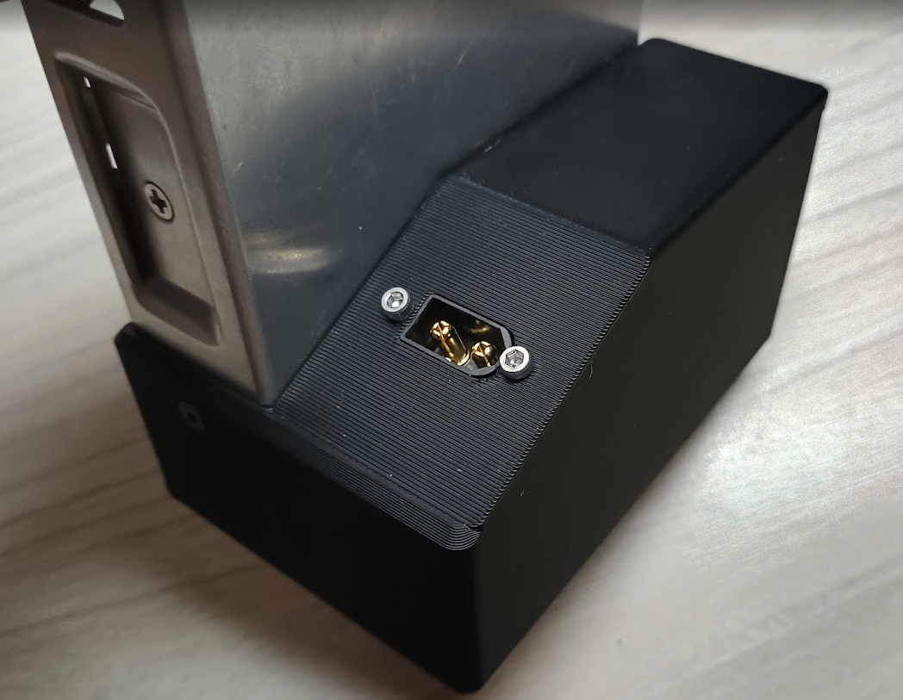
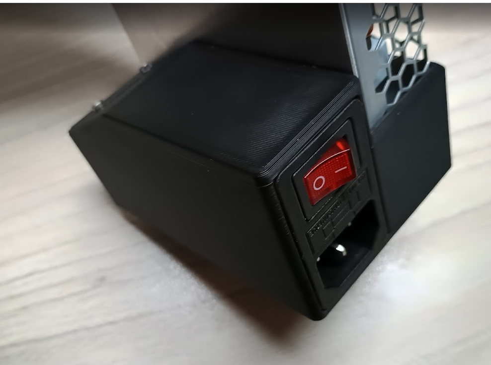

# Alternative LRS150 enclosure

A slightly different enclosure for MeanWell LRS150, 24 volts in particular.

Designed in FreeCAD.

Modeled around [IEC320 Fused Socket](https://www.sunrom.com/p/ac-power-inlet-socket-with-indicator-switchfuse-holder-snap-mount-iec-60320-c14-2500w-250vx10a) and [XT60(i)M socket](https://www.tme.eu/en/details/xt60ie-m/dc-power-connectors/amass/) to output 24 volts. Requres 1x M3x6 FHCS and 2x M2.5x8 SHCS in addition to sockets (and LRS150 of course). 4x 8mm (diameter) anti-slip pads can be added into slots at the bottom.

Print as is (ABS advised - scale 1% up to adjust for shrinking for ABS), solder wires to XT60 and crimp them on the other side (approx 60mm in length). Insert XT60m and affix it with M2.5x6mm or M2.5x8mm. Wire things up, insert LRS150 into its slot and fix LRS150 with M3x6mm FHCS screw. Glue on pads at the bottom.
