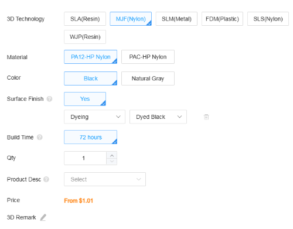
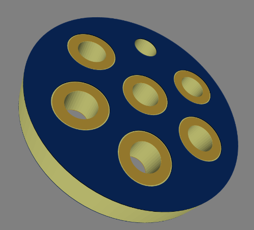
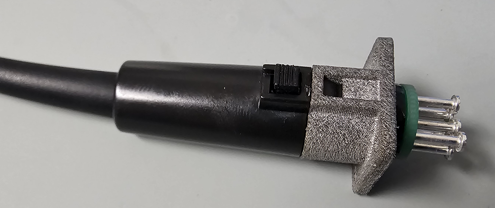
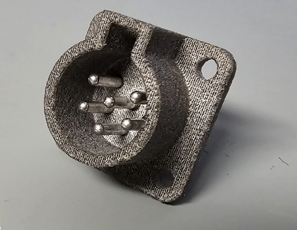
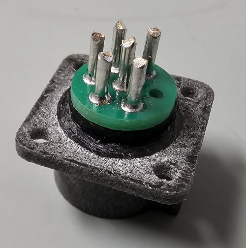

# 3D Printed Housing
The parts can be sources from JLC3DP.com With the following parameters:
- MJF (NYLON)
- with PA12-HP Nylon
 

# PCB
The gerber files and Easy EDA PCB is available in the PCB subfolder. There is no corresponding schematic, this was done by just placing vias on the PCB directly. The PCB is a 2 layer board, thickness 1.6mm.

## Pins
Mill-Max 1460-9-00-80-00-00-03-0 can be used to connect the PCB to the housing. The pins are available at 
[Mouser](https://www.mouser.de/ProductDetail/Mill-Max/1460-9-00-80-00-00-03-0?qs=A6eO%252BMLsxmRGmneDPBh%2F2g%3D%3D&srsltid=AfmBOorVb9K-IJof6xZFDbLfKd0eUqV1-BJbkoN_Je9d1J5wIGALbRr7).

# Assembly
You have to make sure that the pins connect to the handle connector properly while not preventing the housing from being pushed all the way in.
A connector can be pushed into the 3D printed part for aligning the pins and the PCB. While still having everything put together the pins can soldered to the PCB. When having a HT Nylon part, the housing should be able to withstand soldering quickly.

Assembling the PCB apart from the housing is not recommended, since the tolerances of the housing and the handpiece connector are quite tight. It would be hard to get everything aligned properly. 

After assembly just use some wire cutters and trim the pins to the desired length.

