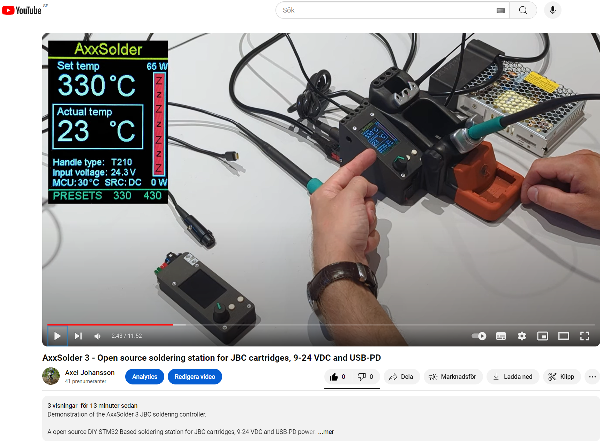
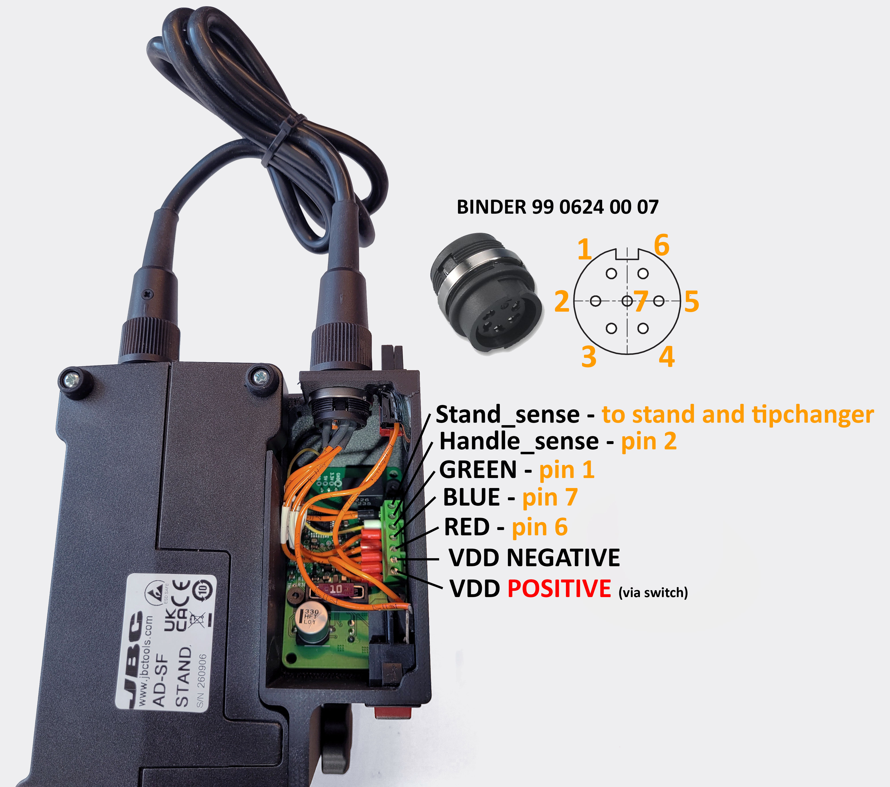
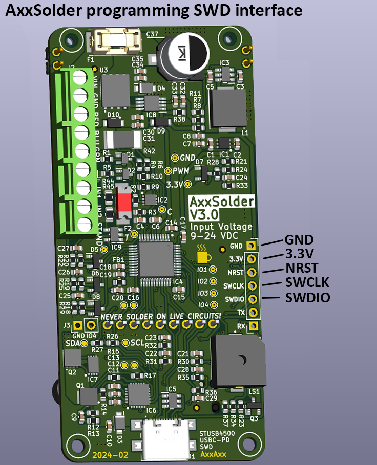
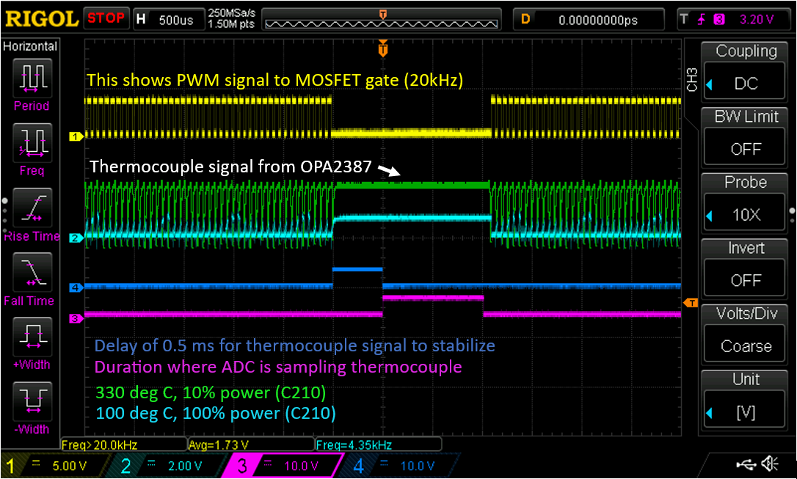
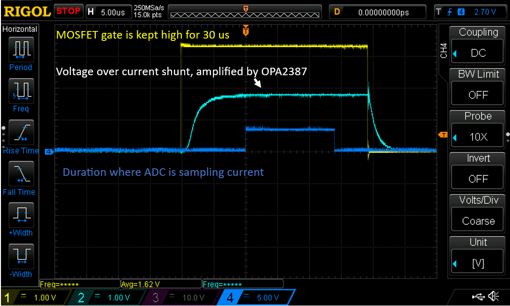

[](https://github.com/AxxAxx/AxxSolder/actions/workflows/build-main.yaml)
[](https://www.gnu.org/licenses/gpl-3.0)
[](https://hits.seeyoufarm.com)
<a href='https://ko-fi.com/axxaxx' target='_blank'>  

  
Interested in purchasing an AxxSolder 3.1? On [Tindie](https://www.tindie.com/stores/axxaxx/) you can purchase assembled and tested AxxSolder 3.1 boards with connectors and hardware.  
<a href="https://www.tindie.com/stores/axxaxx/?ref=offsite_badges&utm_source=sellers_AxxAxx&utm_medium=badges&utm_campaign=badge_medium"></a>

# AxxSolder Overview
AxxSolder is a STM32 based soldering iron controller for JBC C115, C210 and C245 style cartridges.  
Two different versions are designed around the same PCB and software - one soldering station based on the [JBC ADS stand](https://www.jbctools.com/ad-sf-stand-for-t210-t245-handles-product-2018.html) and one portable version. The AxxSodler hardware takes a DC input source of 9-24V OR a USB-C Power Delivery source. The recommended power supply is a Meanwell [LRS-150-24](#recommended-power-supply) which can power all compatible JBC irons at full power. If a 65W, 20V USB-PD supply is used then NT115 and T210 handles can be powered at full power and T245 at limited power. The power limiting is automatic and AxxSolder reads the power capability of the USB-PD source during the negotiating phase and reduces the output power accordingly.  
The software is written for the [STM32G431CBT6](https://www.st.com/en/microcontrollers-microprocessors/stm32g431cb.html) and implements a PID controller for temperature regulation, TFT display driver, sleep functions for when the handle is at rest and various user settings to name a few.  
Enclosures for both station and portable versions are 3D printed and design files are available under [/CAD](https://github.com/AxxAxx/AxxSolder/tree/main/CAD). A video showing the AxxSolder station can be found under [DEMO](#demo). A *bill of materials* (BOM) with individual component prices can be found under [/bom](https://github.com/AxxAxx/AxxSolder/tree/main/AxxSolder_hardware/bom).  


# Questions and support
Please use [Discord](https://discord.gg/AwpHEmsyKj) for build related and general questions.

# Table of Contents
- [AxxSolder Overview](#axxsolder-overview)
- [Questions and support](#questions-and-support)
- [Features](#features)
- [DEMO](#demo)
- [Schematic](#schematic)
- [PCB](#pcb)
- [Software Version History and Hardware Compatibility](#software-version-history-and-hardware-compatibility)
- [AxxSolder Station](#axxsolder-station)
- [AxxSolder Portable](#axxsolder-portable)
- [Recommended power supply for tip grounding](#recommended-power-supply-for-tip-grounding)
- [Handle identification and connections](#handle-identification-and-connections)
- [Firmware update](#firmware-update)
- [First start up after build](#first-start-up-after-build)
- [Settings](#settings)
- [PID control](#pid-control)
- [Cartridge differences](#cartridge-differences)
- [Temperature calibration](#temperature-calibration)
- [Temperature measurement](#temperature-measurement)
- [Current measurement](#current-measurement)
- [Disclaimer](#disclaimer)

# Features
- The tip temperature is set by a rotary encoder. Pressing the encoder puts AxxSolder into Sleep mode and heating is turned off, press again to wake up.  
- AxxSolder is capable of driving C115, C210 and C245 style cartridges from JBC. With two handle sense inputs AxxSolder can determine if the connected handle is either a NT115, T210 or T245 and adjust max output power accordingly. The max output power is software limited to 130 W for T245, 65 W for T210 and 22 W for NT115 handles.
- When the handle is put into the stand (connected to Stand_sense) AxxSolder goes into "Standby mode". On the portable version an aluminium plate is mounted in the case and allows the AxxSolder to go into Standby mode when the cartridge or handle rests against it. After 10 min in Standby mode AxxSolder goes into "Sleep mode" and heating is completely turned off. This is similar to what JBC calls [Sleep and Hibernation](https://www.jbctools.com/intelligent-heat-management.html).  
- If AxxSolder is left in normal running mode for longer than 30 min, the station automatically goes into sleep mode after 30 min as a safety feature.  
- Should the temperature ever go higher than 480 deg C overheating is detected and the station goes into sleep mode in order to protect the tip.
- At start-up any USB-PD source is detected and the highest possible power is negotiated. AxxSolder limits the soldering iron output power to the max output power of the USB-PD source automatically. The maximum power output is displayed at the top of the power bar graph on the display.
- User settings are stored in non-volatile flash and can be configured via a settings menu described in [SETTINGS](#settings).
- The two buttons are used to store temperature presets, e.g. 330 deg C and 430 deg C. Both preset temperatures are configurable in the settings menu.
- There is a 3.3 V logic level output (GPIO4) that can be configured to go high when the iron is in Run mode, controlling e.g. fume extractor via a MosFET or relay.
- The TFT display used in this project is a 2 inch 320x240 Color TFT display [2.0" 320x240 Color IPS TFT Display](https://www.adafruit.com/product/4311) and shows information about:
  - Set temperature
  - Actual temperature
  - Current power as a bar graph
  - In case of sleep mode, the power bar shows "ZzZzZz"
  - In case of Standby mode, the power bar shows "STANDBY"
  - Input voltage
  - MCU temperature
  - Current detected handle type
  - Current max power output
  - Current power source USB-PD / DC

# DEMO
[](https://www.youtube.com/watch?v=I5uLvEM9wpY)
[https://www.youtube.com/watch?v=I5uLvEM9wpY](https://www.youtube.com/watch?v=I5uLvEM9wpY)

# Schematic
The schematic for AxxSolder is shown below. Both station and portable versions use the same PCB and software. The MCU is a [STM32G431CBT6](https://www.st.com/en/microcontrollers-microprocessors/stm32g431cb.html). 


# PCB
The PCBs are designed in KiCad and manufactured by [PCBWay](https://www.pcbway.com/). PCBWay has sponsored this project with PCBs and stencils. The support and quality from PCBWay is great and therefore PCBWay is the recommender PCB supplier for this project. As some components have a rather fine pitch (0,5 mm as of the LQFP-48 package of the STM32) and some packages are "no lead" with a bottom thermal pad e.g. the WSON-8 package of the OPA2387 it is recommended to use a stencil to apply solder paste and then reflow the board using either a reflow oven or hot-plate. The boards on the image below were reflowed on a hot-plate (a homemade AxxPlate). A microscope is also recommended and helpful during assembly.
Printed Circuit Boards with assembled components are shown in the image below.

A 3D view (from and back) of the AxxSolder PCB is generated with KiCad and shown below. 


# Software Version History and Hardware Compatibility
| Version | Date  | Hardware Compatibility |
|---------|------|----------------------|
|[v3.2.2](https://github.com/AxxAxx/AxxSolder/releases/tag/v3.2.2)|Nov 15, 2024|V3.*|
|[v3.2.1](https://github.com/AxxAxx/AxxSolder/releases/tag/v3.2.1)|Sep 21, 2024|V3.*|
|[v3.2.0](https://github.com/AxxAxx/AxxSolder/releases/tag/v3.2.0)|Aug 13, 2024|V3.*|
|[v3.1.0](https://github.com/AxxAxx/AxxSolder/releases/tag/v3.1.0)|Jun 5, 2024|V3.*|
|[v3.0.2](https://github.com/AxxAxx/AxxSolder/releases/tag/v3.0.1)|Apr 25, 2024|V3.*|
|[v3.0.1](https://github.com/AxxAxx/AxxSolder/releases/tag/v3.0.1)|Mar 26, 2024|V3.*|
|[v3.0.0](https://github.com/AxxAxx/AxxSolder/releases/tag/v3.0.0)|Mar 02, 2024|V3.*|
|[v2.2.4](https://github.com/AxxAxx/AxxSolder/releases/tag/v2.2.2)|Dec 11, 2023|V2.*|
|[v2.2.4](https://github.com/AxxAxx/AxxSolder/releases/tag/v2.2.2)|Nov 28, 2023|V2.*|
|[v2.2.3](https://github.com/AxxAxx/AxxSolder/releases/tag/v2.2.2)|Nov 25, 2023|V2.*|
|[v2.2.2](https://github.com/AxxAxx/AxxSolder/releases/tag/v2.2.2)|Oct 24, 2023|V2.*|
|[v2.2.0](https://github.com/AxxAxx/AxxSolder/releases/tag/v2.2.0)|Oct 20, 2023|V2.*|
|[v2.1.3-revC](https://github.com/AxxAxx/AxxSolder/releases/tag/v2.1.3-revC)|Oct 16, 2023|V2.*|
|[v2.1.1](https://github.com/AxxAxx/AxxSolder/releases/tag/v2.1.1)|Oct 7, 2023|V2.*|
|[v2.1.0](https://github.com/AxxAxx/AxxSolder/releases/tag/v2.1.0)|Oct 7, 2023|V2.*|

# AxxSolder Station
The preferred setup is to pair AxxSolder with the [JBC ADS stand](https://www.jbctools.com/ad-sf-stand-for-t210-t245-handles-product-2018.html). This makes a very nice, compact and powerful soldering station. The JBC ADS stand is paired with a custom 3D printed enclosure for AxxSolder and the PCB is mounted with two mounting brackets. All 3D printed parts are available under [/CAD](https://github.com/AxxAxx/AxxSolder/tree/main/CAD). 
  
The JBC ADS stand comes with a silicone cable fitted with two Binder 99-0621-00-07 connectors. In order to use this cable a Binder 99-0624-00-07 is mounted into the AxxSolder enclosure and wired as the image below:  
  
By default, the stand separates the two signals coming from the "tool rest position" and the "tip change position" and does NOT have two separate connections for tip sensing 1 and 2 as is needed if NT115, T210 and T245 handles should all be automatically detected. Therefore, a modification is done to the PCB inside the JBC ADS stand in order to combine the "tool rest position" and the "tip change position" sense into one connection and separate the two tip sense connections. This is shown in the image above. The stand is held together with two PH0 screws from the side.  
NOTE: This modification of the stand is NOT necessary if you know that you will not be using NT115 handles and only require automatic detection of T210 and T245 handles.  
The JBC ADS stand is a expensice piece and thankfully there are many alternatives online for the one who wants to save some money. The community on the AxxSolder Discord channel has created many enclosures for alternative stands.

# AxxSolder Portable
It is often nice to have a compact and portable soldering iron controller for when you are away from your comfortable desk. A neat powerful package with the same capabilities as your main soldering station. This is why AxxSolder Portable was designed. The only difference between AxxSolder station and Portable is the enclosure.  
As AxxSolder accepts an input of 9-24 V it is compatible with a range of battery options. The author usually use a battery pack consisting of 12 Samsung INR18650 35E in a 3S4P configuration which works very well.  
The portable version has an aluminium tab on the enclosure connected to the same input on the PCB as the "handle rest" on the station version. This allows the user to rest the iron onto the aluminium tab and automatically enter sleep mode.   

The connections from the handle to the PCB through the Hirose RPC1-12RB-6P(71) connector is shown below. The Stand_sense in the portable version is connected to the aluminium plate which tells the AxxSolder to go into sleep mode when in contact with the soldering iron.  


# Recommended power supply for tip grounding
A well-suited power supply with isolated output (SELV) is the Meanwell LRS-150-24. It is rated for 156 W at 24 V. By using a power supply with isolated outputs (floating negative terminal) the protective earth connector on AxxSolder can be connected directly to mains earth thus keeping the tip of the soldering iron at earth ground potential. There is a 1A fuse after the earth terminal in paralell with a 1M resistor on the AxxSolder.  
A printable cover protecting the terminals of the for LRS-150-24 can be found under [/CAD](https://github.com/AxxAxx/AxxSolder/tree/main/CAD).  

Another suitable power supply is the Meanwell XLG-150-24 which has a slightly different form factor and is fully enclosed.

# Handle identification and connections
In order for AxxSolder to know which type of handle (NT115, T210, T245) is attached specific pins inside the handle connector must be connected (bridged with a jumper wire). By default, the original JBC handle T245 has NO bridged pins while inside the connector of the original JBC T210 the pins 5 and 6 are bridged with a jumper wire. The original NT115 handle from JBC has a different connector and must be modified accordingly. All the necessary connections are shown in the image below.  
When powering on AxxSolder for the first time after doing these connections inside the handle connector it is wise to attach a handle without its cartridge and ensure that AxxSolder detects and shows the correct handle type on the display.  
Failing to detect the handle type may cause permanent damage to the cartridge as the temperature calibration and max allowed power will be wrong.  
❗WARNING❗ It has been discovered that some JBC clones have different pins bridged by the manufacturer. For example: Some AiXun T210 handles have pin 1 and 6 bridged, instead of pin 5 and 6 as AxxSolder requires for T210 handles. It is however easy to open up the connector and do the required pin connection.      


# Firmware update
Flashing or updating the firmware on the STM32 MCU can be done in two ways, by using a SWD programmer or directly via USB. 
There is a bug in the new ST Programmer software version 2.17 throwing the error: "Error: Database: There's no active configuration for this device.  All the 3 configurations are disabled!" when trying to connect to the MCU.  
Download version 2.15 instead:


## SWD programmer
These come in a variety of models and are available from several different places online. In the below example a [STLINK-V3MINIE](https://www.st.com/en/development-tools/stlink-v3minie.html) SWD programmer is used. The MCU is programmed by the following steps:
1. Disconnect any soldering iron handles from AxxSolder during the firmware update process.
2. Download the latest AxxSolder.bin file from [Releases](https://github.com/AxxAxx/AxxSolder/releases)
3. Connect your SWD programmer to the target MCU with GND, 3.3V, (N)RST, SWCLK, SWDIO
4. If your SWD programmer *can not* supply 3.3V it is necessary to power the AxxSolder from an external supply.
5. Start your programming software. [STM32CubeProgrammer](https://www.st.com/en/development-tools/stm32cubeprog.html) is used in this example.
6. Connect to the target by selecting *ST-LINK* and click on *Connect*
7. Load the latest AxxSolder.bin downloaded in *Step 2* by clicking *Open file* and select the downloaded binary file.
8. Write the firmware to the MCU by clicking *Download*.
9. If you get the message *File download complete* everything succeeded and the SWD programmer can be disconnected and AxxSolder power cycled once and AxxSolder should boot.



## USB (DFU mode)
1. Disconnect any soldering iron handles from AxxSolder during the firmware update process.
2. Download the latest AxxSolder.bin file from [Releases](https://github.com/AxxAxx/AxxSolder/releases)
3. Connect AxxSolder via USB to a computer that runs [STM32CubeProgrammer](https://www.st.com/en/development-tools/stm32cubeprog.html).
4. Hold down the most right button while powering on AxxSolder to enter DFU mode.
5. Connect to the target by selecting *USB* and click on *Connect*
6. Load the latest AxxSolder.bin downloaded in *Step 2* by clicking *Open file* and select the downloaded binary file.
7. Write the firmware to the MCU by clicking *Download*.
8. If you get the message *File download complete* everything succeeded and the USB cable can be disconnected.
9. Power cycle once and AxxSolder should boot.


# First start up after build
The first start up after you have built your AxxSolder can be intense. Double check all solder connections under a loupe/microscope. Especially the OPA2387, LTC4440 and the STM32G431 are small packages with tight pad spacing and can have solder bridges. Do also double check the connections to the soldering iron/stand which are shown in this document under [AxxSolder Station](#axxsolder-station) and [AxxSolder Portable](#axxsolder-portable).  
The first thing to do after you have double-checked everything is to follow the steps under [Firmware update](#firmware-update). It is wise to do the first programming of AxxSolder without any handle piece and with only 3.3 V, not VDD. After the programming is done you can now power up AxxSolder again via either with 3.3 V, this time you can attach your handle. This allows you to test that your handle type is detected correctly (the detected handle type NT115/T210/T245 is shown in the display). The Standby feature can also be tested by touching the stand (STAND Input).  
If the handle is detected correctly, the Standby function works and the display works you proceed to test the 7.35V DC/DC. This is done by once again disconnect the handle, but this time apply current limited 9-24 V VDD. 100 mA at 24 V is enough to check that the display starts and that you can measure the 3 bus voltages; 3.3V, 7.35V and VDD. If the bus voltages look good and the display shows the main screen you are ready to apply full VDD power and attach the soldering handle.  
If you are not 110% sure about your soldering/connections it is wise to be on the safe side and keep your soldering tip in a water bath in over to prevent it from over-heating in an uncontrolled manner. During the development this method was used and saved a few of those expensive JBC cartridges..

# Settings
To access the user settings the user holds down the encoder button at start-up. A SETTINGS text is then presented and the button can be released. While in the settings there are several parameters available.
| Setting | Description  | Unit | Default |
|---------|------|----------------------|----------------------|
|Startup Temp °C|Default temperature selected after boot|deg C|330|
|Temp Offset °C|Temperature offset applied to measured temperature|deg C|0|
|Standby Temp °C|Temperature to go to after handle is set in stand|deg C|150|
|Standby Time [min]|Time for which standby temperature is held before cooling down|minutes|10|
|Sleep Time [min]|Time that the iron can be ON before cooling down (safety feature)|minutes|30|
|Buzzer Enable|Enable or Disable the buzzer|ON/OFF|ON|
|Preset Temp 1 °C|Preset temperature for button 1|deg C|330|
|Preset Temp 2 °C|Preset temperature for button 2|deg C|430|
|GPIO4 ON at run|Enable 3.3V output on GPIO4 when the iron is in run mode|ON/OFF|OFF|
|Screen rotation|Rotate the screen|"0"=-180 deg, "1"=-90 deg, "2"=0 deg, "3"=90 deg|2|
|Limit Power [W]|Limit the output power|"0"=no user limit, "5"=5 W, "10"= 10 W, "15"= 15 W ...|0|
|I measurement|Measure the heater current|ON/OFF|ON
|Startup beep|Beep after startup|ON/OFF|ON
|Temp in celcius|Show temperatures in Celcius and not Fahrenheit|ON/OFF|ON
|Temp cal 100 °C|Actual temperature at 100 °C|deg C|100|
|Temp cal 200 °C|Actual temperature at 200 °C|deg C|200|
|Temp cal 300 °C|Actual temperature at 300 °C|deg C|300|
|Temp cal 350 °C|Actual temperature at 350 °C|deg C|350|
|Temp cal 400 °C|Actual temperature at 400 °C|deg C|400|
|Temp cal 450 °C|Actual temperature at 450 °C|deg C|450|
|Serial debug print|Print debug over serial|ON/OFF|OFF|
|-Load Default-|Load default parameters|N/A|N/A|
|-Save and Reboot-|Exit and Save|N/A|N/A|
|-Exit no Save-|Exit without Save|N/A|N/A|

# PID control
The thermal mass and heat convection differs between different tip designs. Therefore the PID parameters should in theory be adjusted to each different cartridge. As a matter of simplification, the PID parameters are only different between the different handle types, NT115, T210 and T245. This gives a good thermal performance in conducted tests.
```c
/* Cartridge type specific PID parameters */
#define KP_NT115        5
#define KI_NT115        2
#define KD_NT115        0.3
#define MAX_I_NT115     300

#define KP_T210         7
#define KI_T210         4
#define KD_T210         0.3
#define MAX_I_T210      300

#define KP_T245         8
#define KI_T245         2
#define KD_T245         0.5
#define MAX_I_T245      300

/* General PID parameters */
#define PID_MAX_OUTPUT          500
#define PID_UPDATE_INTERVAL     25
#define PID_ADD_I_MIN_ERROR     75
double PID_NEG_ERROR_I_MULT =   7;
double PID_NEG_ERROR_I_BIAS =   1;

/* Max allowed power per handle type */
#define NT115_MAX_POWER         22
#define T210_MAX_POWER 	        65
#define T245_MAX_POWER 	        130
```
The PID parameters are adjusted to achieve a fast response with minimum overshoot and oscillation. The below image is showing the set temperature, actual temperature response as well as the P, I and D contributions during a heat-up cycle from 25 deg C to 330 deg C. This heat-up sequence takes ~1.5 seconds for a C210-007 cartridge.  

 

# Cartridge differences
Cartridges from JBC do all contain a thermocouple element to read the tip temperature and a resistive heater element. The configuration of thermocouple and heater element differ slightly between cartridge models. In order to determine the internal configuration of the cartridges two cross sections were done. These show clearly how the C210 and C245 cartridges are constructed internally. The images can be seen here: [https://www.eevblog.com/forum/projects/axxsolder-jbc-soldering-controller](https://www.eevblog.com/forum/projects/axxsolder-jbc-soldering-controller/msg5124267/#msg5124267).  
As the thermocouple output also differs (see my measurements [Temperature calibration](#temperature-calibration)) the correct handle/cartridge type has to be set. This is done automatically be the inputs "Handle_sense_1" and "Handle_sense_2" This can be done thanks to the design of the handle connector. For the JCB T210 handle pin 5 and 6 are connected internally in the connector and for NT115 pin 3 and 5 should be connected. This allows AxxSolder to sense which handle is connected and assign correct thermocouple correction, PID parameters and max output power.
 
# Temperature calibration
The voltage from the thermocouple embedded inside the cartridge is amplified by an OPA2387 operational amplifier and then read by the ADC of the MCU. To correlate the measured ADC value to the cartridge temperature experiments were done. A constant power was applied to the heating element of the cartridge and the ADC value was read as well as the actual tip temperature. The tip temperature was measured by a "Soldering Tip Thermocouple" used in e.g. the Hakko FG-100.   
The measured data was recorded and plotted for both the C115, C210 and C245 cartridges. The specific cartridges used were the C115112, C210-007 and C245-945. The measured data were fitted to polynomial equations:  
$Temp_{C115}[deg] =  5.10e^{-5} * ADC^2 + 0.42* ADC + 20.15$  
$Temp_{C210}[deg] =  4.22e^{-6} * ADC^2 + 0.32* ADC + 20.97$  
$Temp_{C245}[deg] = -4.73e^{-7} * ADC^2 + 0.12* ADC + 23.78$  
These are then used in the software to retrieve correct tip temperatures.


The user can adjust the temperature calibration at 6 points in order to compensate for variations in the cartridge thermocouple.  
To calibrate temperature(s):
- Make sure that the temperature calibration values are at their default nominal values in the settings.
- Set AxxSolder to the temperature that you want to calibrate. for example 300 deg C.
- When AxxSolder stabilizes around the setpoint, measure the actual tip temperature by using a soldering tip thermocouple, for example the HAKKO FG-100B.
- Input the actual measured temperature, let's say 302 deg C into the 300 deg C calibration setting ("Temp cal 300" = 302).
  
AxxSolder will then use this calibration point and correct the temperature accordingly. It will do so linearly between all calibration points.

# Temperature measurement
As the thermocouple and heater element is connected in series inside the JBC cartridges and the thermocouple voltage measures over the same pins as the heating element we have to be careful when to do the temperature measurement. In order to not disturb the thermocouple measurement with heater element switching, the switching is turned off for 0.5 ms just before the temperature measurement is taken. The 0.5 ms delay ensures that the switching is turned off and the thermocouple signal is stabilized around a stable voltage.  
The measured signal over the thermocouple is clamped to 3.3V with a BAV199 Schottky diode in order to protect the op-amp OPA2387. The voltage measurement is taken by the internal ADC in DMA mode with a circular buffer. The buffer holds several measurements which are averaged and filtered in software.  
The yellow curve in the image below (Channel 1) shows the PWM signal driving the gate of the MOSFET.  
The green curve shows the amplified voltage between GREEN and RED wire in the JBC handle for at 330 degree C and 5% power and the purple 25 degree C and at 80% power (the tip held under water trying to heat up).  
The blue pulse indicates the wait time of 0.5 ms and the purple pulse is where the ADC is sampled.

# Current measurement
The current is sampled four times per second by a 30 us current pulse through the heater. This is done both to check if there is a functioning tip in the handle (otherwise the display shows "---" at current temp) and to be able to calculate the power drawn by the heater. By knowing how much the heater draws in ampere the actual power can be calculated by knowing the bus voltage and pulse duty cycle. to measure the current the gate to the MOSFET is turned on, 10 us later the voltage over the current shunt is sampled by the ADC and the result is converted. This is shown the image below.

# Disclaimer
AxxSolder is an open source project and has absolutely no warranty, or guarantees on functionality or reliability! The authors of this project accept absolutely no liability for any harm or loss resulting from its use. That said, have fun. :)
## Stargazers over time
[](https://starchart.cc/AxxAxx/AxxSolder)

