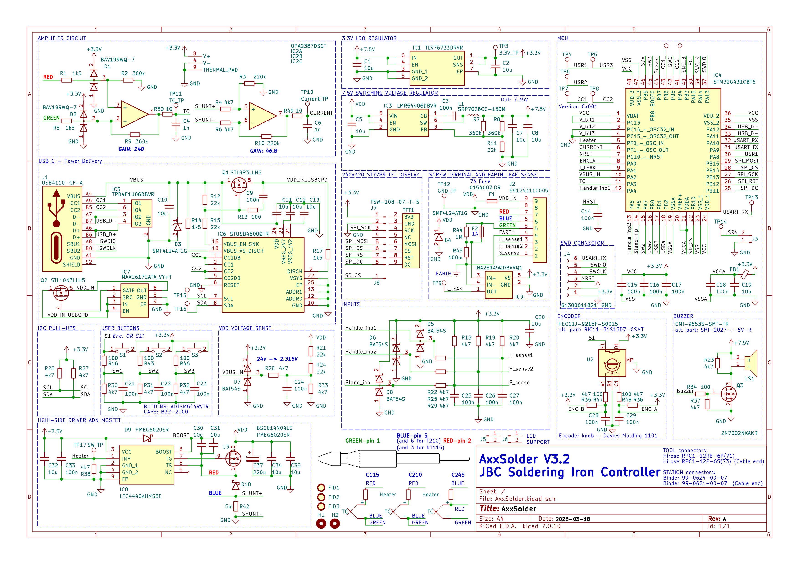

# AxxSolder Overview
AxxSolder is a STM32 based soldering controller for JBC C210 and C245 cartridges. 
Two versions are designed around the same PCB and software - one soldering station based on the [JBC ADS stand](https://www.jbctools.com/ad-sf-stand-for-t210-t245-handles-product-2018.html) and one portable version. The hardware takes an DC input source of 9-26V.  The software is written for the [STM32G431KB](https://www.st.com/en/microcontrollers-microprocessors/stm32g431kb.html) and implements a PID for temperature control, LCD driver and sleep function. A video showing the soldering station working can be found here: XXX.

The schematics for AxxSolder is shown below. BOth the station and portable versions use the same PCB and software. The MCU is a [STM32G431KB](https://www.st.com/en/microcontrollers-microprocessors/stm32g431kb.html) and the PCB footprint allows for either the UFQFPN32 or LQFP32 package. 

The OLED display used is a 1.5 inch 128 x 128 pixel SPI Display [WaveShare 1.5inch OLED Module](https://www.waveshare.com/wiki/1.5inch_OLED_Module) and shows:
* Set temperature
* Actual temperature
* Current power as a bar on the right side
* In case of sleep mode, the power bar shows ZzZzZz
* Input voltage
* Ambient temperature
* Current Handle type

Cartridges from JBC do all contain a thermocouple elemnt to read the tip temperature and a reesistivie heater element. The configuaration of thermocouple and heater element differ slightly between cartrige models. This has previosuly been shown by several other authors. XXX XXX XXX to name a few. 




## AxxSolder Station

## AxxSolder Portable


## PID control
As the thermal mass of each cartridge differs the PID parametes should in theory be adjusted to each different cartridge. As a matter of simplification the PID parameters are only different between the different handle types, T210 and T245. This gives a good enough PID performance in my tests. Also the max allowed power is different between handle types.
```c
	// Set-up handle-specific constants
	if(handle == T210){
		max_power = 60;// 60W
		Kp = 30;
		Ki = 50;
		Kd = 0.5;
	}
	else if(handle == T245){
		max_power = 120;// 120W
		Kp = 50;
		Ki = 50;
		Kd = 1;
	}
```
 
## Temperature calibration
The voltage from the thermocouple embedded insde the cartrige is amplified by a OPA2333 operational amplifier and then read by the ADC of the MCU. To correlate the measured ADC value to the cartiridge temperature experimenswere done. A constant power was applied to the heating element of the cartridge and the ADC value was read as well as the actual tip temperature. The tip temperature was measured by a "Soldering Tip Thermocouple" used in e.g. the Hakko FG-100.   
The measured data was recorded and plotted for both the C210 and C245 cartridges. The specific cartridges used were the C210-007 and C245-945. The measured data were fitted to polynomial equations:  
$Temp_{C210}[deg] =  -6.798e^{-9} * ADC^3 -6.084e^{-6} * ADC^2 + 0.271* ADC + 25.399$  
$Temp_{C245}[deg] = 2.092e^9 * ADC^3 -1.213e^{-5} * ADC^2 + 0.118* ADC + 25.052$  
which were used in the software to retrieve correct tip temperatures. 
  
## Temperature measurement
As the thermocouple and heater element is connected in series inside the JBC cartridges and the thermocouple voltage measures over the same pins as the heating element we have to be careful when to do the measurement. In order to not disturb the thermocouple measurement with heater element switching, the switching is turned of for 10 ms just before the temperature measurement is taken. The 10 ms delay ensures that the switching is turned off and the themocouple signal is stabilized around a stable voltage.  
The measured signal over the thermocouple is clamped to 3.3V with a BAT54S Schottky diode in order to protect the opamp OPA2333. The voltage measurement is taked by the internal ADC in DMA mode with a circular buffer. The buffer holds several measurements which are averaged in software.  
The yellow curve in the image below (Channel 1) shows every time the circular buffer is filled. Just after the 10 ms delay time the measurements are taken from the buffer. In the image below the time period where the last thermocouple measurements are taken is indicated as a red rectangle. The green curve shows the amplified voltage between GREEN and RED wire in the JBC handle for at 330 degree C and 5% power and the purple 25 degree C and at 100% power (the tip held under water trying to heat up).

