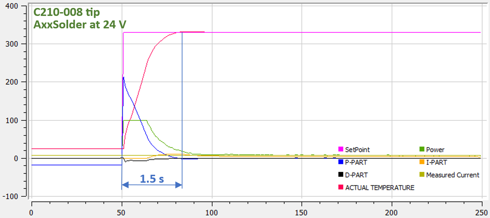

[](https://www.gnu.org/licenses/gpl-3.0)
[](https://hits.seeyoufarm.com)
<a href='https://ko-fi.com/axxaxx' target='_blank'>  

# AxxSolder Overview
AxxSolder is a STM32 based soldering iron controller for JBC C115, C210 and C245 cartridges. 
Two different versions are designed around the same PCB and software - one soldering station based on the [JBC ADS stand](https://www.jbctools.com/ad-sf-stand-for-t210-t245-handles-product-2018.html) and one portable version. The hardware takes a DC input source of 9-24V OR a USB-C Power Delivery source.  The software is written for the [STM32G431CBT6](https://www.st.com/en/microcontrollers-microprocessors/stm32g431cb.html) and implements a PID for temperature control, TFT display driver, sleep function when the handle is at rest and functions for read/write user settings to flash. Enclosures for both station and portable versions are 3D printed and design files are availible under [/CAD](https://github.com/AxxAxx/AxxSolder/tree/main/CAD). A video showing the AxxSolder station can be found under [DEMO](#demo). A *bill of materials* (BOM) with individual component prices can be found under [/bom](https://github.com/AxxAxx/AxxSolder/tree/main/PCB/AxxSolder/bom).  


# Questions and support
Please use [Discord](https://discord.gg/VPZyf4GYUQ) for build related and general questions.

# Table of Contents
- [AxxSolder Overview](#axxsolder-overview)
- [Questions and support](#questions-and-support)
- [Features](#features)
- [Cartridge differences](#cartridge-differences)
- [Schematic](#schematic)
- [Software Version History and Hardware Compability](#software-version-history-and-hardware-compability)
- [DEMO](#demo)
- [AxxSolder Station](#axxsolder-station)
- [AxxSolder Portable](#axxsolder-portable)
- [Firmware update](#firmware-update)
- [First start up after build](#first-start-up-after-build)
- [PID control](#pid-control)
- [Temperature calibration](#temperature-calibration)
- [Temperature measurement](#temperature-measurement)

# Features
- The tip temperature is set by a rotating encoder. Pressing the encoder puts AxxSolder into Sleep mode and heating is turned off, press again to wake up.  
- AxxSolder is capable of driving C115, C210 and C245 style cartridges from JBC. With the "Handle_sense_1" and "Handle_sense_2" inputs AxxSolder can determine if the connected handle is either a NT115, T210 or T245 and adjust max output power accordingly.  
- When the handle is put into the stand (connected to Stand_sense) AxxSolder goes into "Standby mode". On the portable version an aluminium plate is mounted and allows the AxxSolder to go into Standby mode when the cartridge or handle rests againts it. After 10 min in Standby mode AxxSolder goes into "Sleep mode" and turns heating completely off. This is similar to what JBC calls [Sleep and Hibernation](https://www.jbctools.com/intelligent-heat-management.html).  
- If AxxSolder is left in normal running mode for longer than 30 min, the station automatically goes into sleep mode after 30 min as a safety feature.  
- Should the temperature ever go higher than 480 deg C overheating is detected and the station goes into sleep mode in order to protect the tip.
- User settings are stored in non volatile flash and can be configured via a settings menue descrbied in [SETTINGS](#settings).
- The TFT display used in this project is a 2 inch 320x240 Color TFT display [2.0" 320x240 Color IPS TFT Display](https://www.adafruit.com/product/4311) and shows information about:
  - Set temperature
  - Actual temperature
  - Current power as a bar graph
  - In case of sleep mode, the power bar shows "ZzZzZz"
  - In case of Standby mode, the power bar shows "STANDBY"
  - Input voltage
  - MCU temperature
  - Current detected handle type

# Cartridge differences
Cartridges from JBC do all contain a thermocouple element to read the tip temperature and a resistive heater element. The configuration of thermocouple and heater element differ slightly between cartridge models. In order to determine the internal configuration of the cartridges two cross secions were done. These show clearly how the C210 and C245 cartridges are constructed internally. The images can be seen here: [https://www.eevblog.com/forum/projects/axxsolder-jbc-soldering-controller](https://www.eevblog.com/forum/projects/axxsolder-jbc-soldering-controller/msg5124267/#msg5124267).
As the thermocouple output also differs (see my measurements [Temperature calibration](#temperature-calibration)) the correct handle/cartridge type has to be set. This is done automatically be the inputs "Handle_sense_1" and "Handle_sense_2" This can be done thanks to the design of the handle connector. For the JCB T210 handle pin 5 and 6 is connected internaly in the connector. This allows AxxSolder to sense which handle is connected and assign correct thermocouple correction, PID parameters and max output power.

# Schematic
The schematic for AxxSolder is shown below. Both station and portable versions use the same PCB and software. The MCU is a [STM32G431CBT6](https://www.st.com/en/microcontrollers-microprocessors/stm32g431cb.html). 

A 3D view (from and back) of the AxxSolder PCB is generated with KiCAD and shown below. 


# Software Version History and Hardware Compability
| Version | Date  | Hardware Compability |
|---------|------|----------------------|
|[v2.2.4](https://github.com/AxxAxx/AxxSolder/releases/tag/v2.2.2)|Dec 11, 2023|V2.*|
|[v2.2.4](https://github.com/AxxAxx/AxxSolder/releases/tag/v2.2.2)|Nov 28, 2023|V2.*|
|[v2.2.3](https://github.com/AxxAxx/AxxSolder/releases/tag/v2.2.2)|Nov 25, 2023|V2.*|
|[v2.2.2](https://github.com/AxxAxx/AxxSolder/releases/tag/v2.2.2)|Oct 24, 2023|V2.*|
|[v2.2.0](https://github.com/AxxAxx/AxxSolder/releases/tag/v2.2.0)|Oct 20, 2023|V2.*|
|[v2.1.3-revC](https://github.com/AxxAxx/AxxSolder/releases/tag/v2.1.3-revC)|Oct 16, 2023|V2.*|
|[v2.1.1](https://github.com/AxxAxx/AxxSolder/releases/tag/v2.1.1)|Oct 7, 2023|V2.*|
|[v2.1.0](https://github.com/AxxAxx/AxxSolder/releases/tag/v2.1.0)|Oct 7, 2023|V2.*|

# DEMO
Click on the gif to get to YouTube and see the demo in full resolution.  
[](https://www.youtube.com/watch?v=-3MtJyTwZFQ)
# AxxSolder Station

The connections from the station to the PCB throught the BINDER 99 0624 00 07 connector is shown below. The Stand_sense input on AxxSolder is connected to both pin 4 and 5. These are in turn connected in the stand to the tip changer and the iron holder respectively. The yellow wire is connected to pin 2 and is used to determine which handle is connected.

# AxxSolder Portable
It is often nice to have a compact and portable soldering iron controller for when you are away from your comfortable desk. A neat powerful package with the same capabilities as your main soldering station. This is why AxxSolder Portable was designed. The only difference between AxxSolder station and Portable is the enclosure. As AxxSolder accepts an input of 9-24 V it is compatible with a range of battery options. The author usually use a battery pack consisting of 12 Samsung INR18650 35E in a 3S4P configuration which works very well. The portable version has an aluminium tab on the enclosure connected to the same input on the PCB as the "handle rest" on the station version. This allows the user to rest the iron onto the aluminium tab and automatically enter sleep mode.   

The connections from the handle to the PCB throught the Hirose RPC1-12RB-6P(71) connector is shown below. The blue wire in the portable version is connected to the aluminium plate which tells the AxxSolder to go into sleep mode when in contact with the soldering iron. The yellow wire is connected to pin 6 and is used to determine which handle is connected.

# Firmware update
Programming or updating the firmware the STM32 MCU is done by using a SWD programmer. These come in a variety of models and are availible from several different places online. In the below eaxample a [STLINK-V3MINIE](https://www.st.com/en/development-tools/stlink-v3minie.html) SWD programmer is is used. The MCU is programmed by the following steps:
1. Disconnect any soldering iron handles from AxxSolder during the firmware update processs.
2. Download the latest AxxSolder.bin file from [Releases](https://github.com/AxxAxx/AxxSolder/releases)
3. Connect your SWD programmer to the target MCU with GND, 3.3V, (N)RST, SWCLK, SWDIO
4. If your SWD programmer *can not* supply 3.3V it is necessary to power the AxxSolder from an external supply.
5. Start your programming software. [STM32CubeProgrammer](https://www.st.com/en/development-tools/stm32cubeprog.html) is used in this example.
6. Connect to the target by selecting *ST-LINK* and click on *Connect*
7. Load the latest AxxSolder.bin donwloaded in *Step 2* by clicking *Open file* and select the donwloaded binary file.
8. Write the firmware to the MCU by clicking *Download*.
9. If you get the message *File download complete* everything succeded and the SWD programmer can be disconnected and power cycled once and AxxSolder should boot.


# First start up after build
The first start up after you have built your AxxSolder can be intense. Double check all solder connections under a loupe/microscope. Especially the OPA2333, LTC4440 and the STM32G431 are small packages with tight pad spacing and can have solder bridges. Do also double check the connections to the soldering iron/stand which are shown in this document under [AxxSolder Station](#axxsolder-station) and [AxxSolder Portable](#axxsolder-portable).  
The first thing to do after you have double-checked everything is to follow the steps under [Firmware update](#firmware-update). It is wise to do the first programming of AxxSolder without any handle piece and with only 3.3 V or 5 V power input, not VDD. After the programming is done you can now power up AxxSolder again via either with 3.3 V or 5 V, this time you can attach your handle. This allows you to test that your handle type is detected correctly (the detected handle type T210/T245 is shown in the display). The Standby feature can also be tested by touching the stand (STAND Input).  
If the handle is detected correctly, the Standby function works and the display works you proceed to test the 5V DC/DC. This is done by once again disconnect the handle, but this time apply current limited 9-24 V VDD. 100 mA at 24 V is enough to check that the display starts and that you can measure the 3 bus voltages; 3.3V, 5V and VDD. If the the bus voltages looks good and the display shows the main screen you are ready to apply full VDD power and attach the soldering handle.  
If you are not 110% sure about your soldering/connections it is wise to be on the safe side and keep your soldering tip in a waterbath in over to prevent it from over-heating in an uncontrolled manner. During the development this method was used and saved a few of thoese expensive JBC cartridges..

# PID control
As the thermal mass of each cartridge differs the PID parameters should in theory be adjusted to each different cartridge. As a matter of simplification the PID parameters are only different between the different handle types, NT115, T210 and T245. This gives a good enough PID performance in my tests. The Max allowed power is also different between handle types.
```c
	/* Determine if NT115 handle is detected */
	if((sensor_values.handle1_sense >= 0.5) && (sensor_values.handle2_sense < 0.5)){
		handle = NT115;
		sensor_values.max_power_watt = 20; //20W
		Kp = 3;
		Ki = 1;
		Kd = 0.25;
	}
	/* Determine if T210 handle is detected */
	else if((sensor_values.handle1_sense < 0.5) && (sensor_values.handle2_sense >= 0.5)){
		handle = T210;
		sensor_values.max_power_watt = 60; //60W
		Kp = 5;
		Ki = 5;
		Kd = 0.5;
	}
	else{
		handle = T245;
		sensor_values.max_power_watt = 120; //120W
		Kp = 8;
		Ki = 3;
		Kd = 0.5;
	}
	PID_SetTunings(&TPID, Kp, Ki, Kd); // Update PID parameters based on handle type
```
The PID parameters are adjusted to achieve a fast response with minimum overshoot and oscillation. The below image is showing the set temperature, actual temperature response as well as the P, I and D contributions during a heat-up cycle from 25 deg C to 330 deg C. This heat-up sequence takes ~1.5 seconds for a C210-007 cartridge.  

 
# Temperature calibration
The voltage from the thermocouple embedded inside the cartridge is amplified by an OPA2387 operational amplifier and then read by the ADC of the MCU. To correlate the measured ADC value to the cartridge temperature experiments were done. A constant power was applied to the heating element of the cartridge and the ADC value was read as well as the actual tip temperature. The tip temperature was measured by a "Soldering Tip Thermocouple" used in e.g. the Hakko FG-100.   
The measured data was recorded and plotted for both the C115, C210 and C245 cartridges. The specific cartridges used were the C115112, C210-007 and C245-945. The measured data were fitted to polynomial equations:  
$Temp_{C115}[deg] =  5.88e^{-5} * ADC^2 + 0.40* ADC + 24.07$  
$Temp_{C210}[deg] =  8.44e^{-6} * ADC^2 + 0.31* ADC + 24.06$  
$Temp_{C245}[deg] = -1.22e^{-7} * ADC^2 + 0.11* ADC + 25.53$  
These are then used in the software to retrieve correct tip temperatures.


# Temperature measurement
As the thermocouple and heater element is connected in series inside the JBC cartridges and the thermocouple voltage measures over the same pins as the heating element we have to be careful when to do the temperature measurement. In order to not disturb the thermocouple measurement with heater element switching, the switching is turned off for 0.5 ms just before the temperature measurement is taken. The 0.5 ms delay ensures that the switching is turned off and the thermocouple signal is stabilized around a stable voltage.  
The measured signal over the thermocouple is clamped to 3.3V with a BAV199 Schottky diode in order to protect the opamp OPA2387. The voltage measurement is taken by the internal ADC in DMA mode with a circular buffer. The buffer holds several measurements which are averaged and filtered in software.  
The yellow curve in the image below (Channel 1) shows the PWM signal driving the gate of the mosfet. The green curve shows the amplified voltage between GREEN and RED wire in the JBC handle for at 330 degree C and 5% power and the purple 25 degree C and at 80% power (the tip held under water trying to heat up).
The blue pulse indicates the wait time of 0.5 ms and the purple pulse is where the ADC is sampled.


