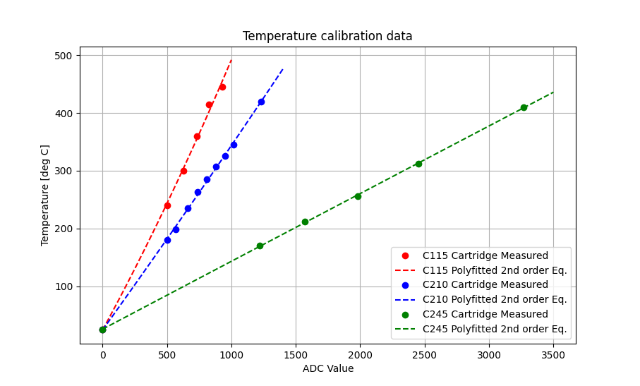

# AxxSolder Overview
AxxSolder is a STM32 based soldering iron controller for JBC C210 and C245 cartridges. 
Two different versions are designed around the same PCB and software - one soldering station based on the [JBC ADS stand](https://www.jbctools.com/ad-sf-stand-for-t210-t245-handles-product-2018.html) and one portable version. The hardware takes a DC input source of 9-26V.  The software is written for the [STM32G431KB](https://www.st.com/en/microcontrollers-microprocessors/stm32g431kb.html) and implements a PID for temperature control, LCD driver and a sleep function when the handle is at rest. Enclosures for both station and portable versions are 3D printed and design files are availible under [/CAD](https://github.com/AxxAxx/AxxSolder/tree/main/CAD). A video showing the AxxSolder station can be found under [DEMO](#demo).

The schematic for AxxSolder is shown below. Both station and portable versions use the same PCB and software. The MCU is a [STM32G431KB](https://www.st.com/en/microcontrollers-microprocessors/stm32g431kb.html) and the PCB footprint allows for either UFQFPN32 or LQFP32 package. 

The OLED display used in this project is a 1.5 inch 128 x 128 pixel SPI Display [WaveShare 1.5inch OLED Module](https://www.waveshare.com/wiki/1.5inch_OLED_Module) and shows information about:
* Set temperature
* Actual temperature
* Current power as a bar graph
* In case of sleep mode, the power bar shows "ZzZzZz"
* Input voltage
* Ambient temperature
* Current handle type

Cartridges from JBC do all contain a thermocouple element to read the tip temperature and a resistive heater element. The configuration of thermocouple and heater element differ slightly between cartridge models. This has previously been shown by several other authors, for example: [http://adgd.ru/2021/01/04/jbc-soldering-cartridges-pinouts/](http://adgd.ru/2021/01/04/jbc-soldering-cartridges-pinouts/). As the thermocouple output also differs (see my measurements [Temperature calibration](#temperature-calibration)) the correct handle/cartridge type has to be set. The PID parameters will be set as well based on selected handle type. The selection is done by holding down the encoder knob while starting the AxxSolder. A menu will then allow the user to select the proper handle (T210 or T245). The default handle is T210.

The AxxSolder goes into sleep mode when the soldering iron is not used. This happens when the handle is placed in the soldering iron holder or is in contact with the cartrigde pull-out bracket on the station. On the portable version an aluminium plate is mounted and allows the AxxSolder to go into sleep when the cartridge or handle rests againts it.


A 3D view (from and back) of the AxxSolder PCB is generated with KiCAD and shown below. 

## DEMO
Click on the gif to get to YouTube and see the demo in full resolution.  
[](https://www.youtube.com/watch?v=-3MtJyTwZFQ)
## AxxSolder Station

## AxxSolder Portable
Many times it is nice to have a portable soldering iron with the same features and power as the station. I therefore created a portable version of the AxxSolder station. As AxxSolder accepts an input of 9-26 V it is compatible with a range of battery options. I usually use a pack consisting of 12 Samsung INR18650 35E in a 3S4P configuration which works very well. The portable version has a aluminium tab connected as a sleep detection input that allows sleep mode when the handle is put aside.   

The connections from the handle to PCB throught the Hirose RPC1-12RB-6P(71) is shown below. The blue wire in the portable version is connected to an aluminum plate with allows the Soldering iron to go to sleep when the cartridge or handle piece is resting against this plate.

## PID control
As the thermal mass of each cartridge differs the PID parameters should in theory be adjusted to each different cartridge. As a matter of simplification the PID parameters are only different between the different handle types, T210 and T245. This gives a good enough PID performance in my tests. The Max allowed power is also different between handle types.
```c
    // Set-up handle-specific constants
    if(handle == T210){
        max_power = 60;// 60W
        Kp = 30;
        Ki = 50;
        Kd = 0.5;
    }
    else if(handle == T245){
        max_power = 120;// 120W
        Kp = 50;
        Ki = 50;
        Kd = 1;
    }
```
The PID parameters are adjusted to achieve a fast response with minimum overshoot and oscillation. The below image is showing the set temperature, actual temperature response as well as the P, I and D contributions during a heat-up cycle from 25 deg C to 330 deg C. This heat-up sequence takes ~1.5 seconds for a C210-007 cartridge.  

 
## Temperature calibration
The voltage from the thermocouple embedded inside the cartridge is amplified by an OPA2333 operational amplifier and then read by the ADC of the MCU. To correlate the measured ADC value to the cartridge temperature experiments were done. A constant power was applied to the heating element of the cartridge and the ADC value was read as well as the actual tip temperature. The tip temperature was measured by a "Soldering Tip Thermocouple" used in e.g. the Hakko FG-100.   
The measured data was recorded and plotted for both the C210 and C245 cartridges. The specific cartridges used were the C210-007 and C245-945. The measured data were fitted to polynomial equations:  
$Temp_{C210}[deg] =  -6.798e^{-9} * ADC^3 -6.084e^{-6} * ADC^2 + 0.271* ADC + 25.399$  
$Temp_{C245}[deg] = 2.092e^9 * ADC^3 -1.213e^{-5} * ADC^2 + 0.118* ADC + 25.052$  
These are then used in the software to retrieve correct tip temperatures.


## Temperature measurement
As the thermocouple and heater element is connected in series inside the JBC cartridges and the thermocouple voltage measures over the same pins as the heating element we have to be careful when to do the temperature measurement. In order to not disturb the thermocouple measurement with heater element switching, the switching is turned off for 10 ms just before the temperature measurement is taken. The 10 ms delay ensures that the switching is turned off and the thermocouple signal is stabilized around a stable voltage.  
The measured signal over the thermocouple is clamped to 3.3V with a BAT54S Schottky diode in order to protect the opamp OPA2333. The voltage measurement is taken by the internal ADC in DMA mode with a circular buffer. The buffer holds several measurements which are averaged and filtered in software.  
The yellow curve in the image below (Channel 1) shows every time the circular buffer is filled. Just after the 10 ms delay time the measurements are taken from the buffer. In the image below the time period where the last thermocouple measurements are taken is indicated as a red rectangle. The green curve shows the amplified voltage between GREEN and RED wire in the JBC handle for at 330 degree C and 5% power and the purple 25 degree C and at 100% power (the tip held under water trying to heat up).


