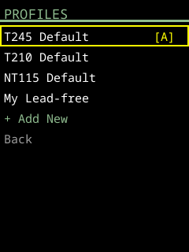
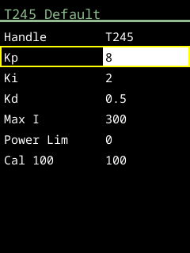
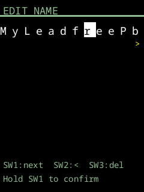
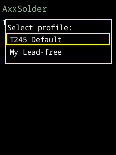

# Tip Profiles

Tip profiles let you save per-tip PID tuning, power limits, and temperature calibration points. Each profile is bound to a handle type and can be set as the active profile for that handle.

---

## Data model

### `TipProfile` (72 bytes)

| Field | Type | Description |
|---|---|---|
| `name` | `char[24]` | Display name |
| `handle_type` | `uint8_t` | `NT115 / T210 / T245 / No_name` |
| `kp / ki / kd` | `float` | PID coefficients |
| `max_i` | `float` | Integrator clamp (±) |
| `power_limit` | `float` | Watts cap; `0` = use the global setting |
| `temp_cal[6]` | `float[6]` | Calibration offsets at 100 / 200 / 300 / 350 / 400 / 450 °C |

### `ProfileStore` (1744 bytes)

Stored in flash as a single block:

```
magic (4) | version (1) | count (1) | active_idx[4] (4) | reserved (6) | TipProfile[24] (1728)
```

- `magic` = `0x54495031` ("TIP1") — used to detect an uninitialised page.
- `count` — number of valid profiles (0–24).
- `active_idx[4]` — one active profile index per handle slot (`0xFF` = none).
  - slot 0 → NT115, slot 1 → T210, slot 2 → T245, slot 3 → No_name.

Up to **24 profiles** total across all handle types (`MAX_PROFILES = 24`).
Total store size: 16 + 24 × 72 = **1744 bytes** — fits in the 2 KB `PROFILES` flash page.

---

## Storage

Profiles are stored in a dedicated flash section (`PROFILES` linker region, 2 KB). The backend is selected at build time via a CMake cache variable:

```cmake
cmake -DSTORAGE_PROFILES=FLASH ..   # default
cmake -DSTORAGE_PROFILES=EEPROM ..
cmake -DSTORAGE_PROFILES=SDCARD ..
```

On first boot (magic mismatch or version change), four built-in default profiles are written — one per handle type.

The flash write driver appends an 8-byte CRC after the payload. The internal write buffer is 2048 bytes, which covers the full `ProfileStore` (1744 bytes data + 8 bytes CRC = 1752 bytes).

---

## Initialisation

```c
tip_profiles_init(const StorageDriver *drv);
```

Called from `main()` after the storage driver is ready. Reads the stored block; falls back to defaults if the block is missing or version-mismatched.

---

## Active profile per handle

Each handle type has one active profile index stored in `active_idx[]`.

```c
tip_profiles_set_active(enum handles h, uint8_t idx);
uint8_t tip_profiles_get_active(enum handles h);   // returns 0xFF if none
```

When a handle is detected:
- `tip_profiles_apply_pid()` — loads `kp / ki / kd / max_i` into the PID controller.
- `tip_profiles_get_power_limit()` — returns the per-profile watt cap.
- `tip_profiles_get_cal(h, cal_index)` — returns the calibration value for a given temperature point (0 = 100 °C … 5 = 450 °C).

If no profile is active for a handle, the functions fall back to the first profile whose `handle_type` matches, then to identity values.

---

## CRUD API

```c
uint8_t     tip_profiles_count(void);
TipProfile *tip_profiles_get(uint8_t index);
StoreResult tip_profiles_add(const TipProfile *p);      // STORE_ERR_FULL if count == MAX_PROFILES
StoreResult tip_profiles_update(uint8_t index, const TipProfile *p);
StoreResult tip_profiles_delete(uint8_t index);
StoreResult tip_profiles_save(void);
```

All writes operate on the in-RAM cache. Call `tip_profiles_save()` to persist to flash.

### Delete behaviour

When the deleted profile is the active one for a handle slot, `tip_profiles_delete` automatically reassigns that slot to the first remaining profile with the same handle type. If no such profile exists the slot is cleared (`0xFF`). Remaining `active_idx` references with higher indices are decremented to stay valid after the array compaction.

---

## Menu

### Profiles menu (`Settings → Profiles`)

Lists all profiles. Each entry shows the profile name; the currently active profile for the attached handle is marked `[A]`. The header shows `[count:max]` (e.g. `[4:24]`) right-aligned.



| Action | How |
|---|---|
| Open profile editor | Press encoder on a profile |
| Add new profile | Select `+ Add New` (hidden when 24 profiles exist) |
| Return | Select `Back` |

A new profile is pre-filled with T245 defaults and named `Profile N`. All fields can be changed in the editor before saving.

### Profile editor fields



| Field | Behaviour |
|---|---|
| Name `[...]` | Press to open the name editor (see below) |
| Handle | Cycles NT115 → T210 → T245 → No_name on press |
| Kp / Ki / Kd / Max I / Power Lim | Encoder increments/decrements; press to confirm |
| Cal 100 … Cal 450 | Same encoder edit |
| `-Set Active-` | Saves edits and sets this profile as active for its handle |
| `-Delete-` | Deletes the profile; active slot is reassigned automatically |
| `Back` | Saves edits, returns to the profile list |

### Name editor

A full-screen character-by-character editor. The current character is shown inverted; a scrolling 12-character window (using the standard menu font) keeps the cursor visible for names up to 23 characters long. `[...]` indicators appear at the left or right edge when the name extends beyond the visible window.



Character set: `(space) A–Z a–z 0–9 - _ .`

| Control | Action |
|---|---|
| Encoder | Cycle through character set at cursor position |
| SW_1 (short) | Accept character, advance cursor right |
| SW_2 (short) | Move cursor left |
| SW_3 (short) | Delete character at cursor (shift tail left) |
| SW_1 (long) | Confirm name and exit |

Trailing spaces are trimmed on exit. An empty result is replaced with `"Profile"`.

### Quick-select popup

When a new handle is detected and `Profile on tip chg` is enabled in Settings, a popup lists all profiles matching the new handle type:



- **1 match** — selected automatically, no popup shown.
- **2+ matches** — popup appears; encoder chooses, press confirms. SW_2 cancels (keeps current active profile).
- **0 matches** — popup skipped.
